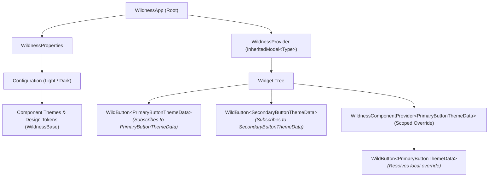

# Wildness UI 🌿

<p align="center">
  
</p>

<p align="center">
  <strong>A modular, type-safe, component-driven Flutter design system framework with granular rebuilds & golden testing.</strong>
</p>

<p align="center">
  <a href="https://pub.dev/packages/wildness_ui"></a>
  <a href="https://pub.dev/packages/wildness_ui_golden_toolkit"></a>
  <a href="https://flutter.dev"></a>
  <a href="https://dart.dev"></a>
  <a href="https://opensource.org/licenses/MIT"></a>
</p>

---

## 💡 Why Wildness UI?

Traditional Flutter theming via `ThemeData` bundles all styles into a monolithic object, causing unnecessary whole-tree rebuilds when tokens update and offering no compile-time guarantees for custom design systems.

**Wildness UI** provides a pure, unopinionated architecture designed specifically for enterprise-grade design systems:

- ⚡ **Granular Rebuilds**: Built on `InheritedModel<Type>`, widgets only re-render when the specific component token they consume changes.
- 🛡️ **F-Bounded Type Safety**: Strongly-typed component contracts (`WildnessBase<T extends WildnessBase<T>>`) eliminating `dynamic` casts and runtime exceptions.
- 🎨 **Multi-Kind (Variant) Architecture**: Parameterize a single component widget (`WildButton<K>`) across unlimited variants (*Primary*, *Secondary*, *Outline*, *Ghost*) sharing common base styling logic.
- 🌓 **Zero-Boilerplate Theme Switching**: Automatic Light & Dark token resolution with unified properties.
- 📍 **Scoped Subtree Overrides**: Override any component or token locally anywhere in the widget tree using `WildnessComponentProvider<T>`.
- 📸 **Integrated Golden Testing**: Companion golden toolkit with pre-configured device matrixes and scenario builders.

---

## 📦 Monorepo Packages

| Package | Version | Description |
| :--- | :--- | :--- |
| [`wildness_ui`](packages/wildness_ui) | [](https://pub.dev/packages/wildness_ui) | Core design system engine with F-bounded polymorphism, `WildnessComponentProvider`, and aspect-based rebuilds. |
| [`wildness_ui_golden_toolkit`](packages/wildness_ui_golden_toolkit) | [](https://pub.dev/packages/wildness_ui_golden_toolkit) | Lightweight golden testing toolkit for testing scenarios and device matrixes with zero boilerplate. |

---

## 🏛️ Architecture Overview



---

## 🚀 Quick Start Guide

### 1. Installation

Add `wildness_ui` to your `pubspec.yaml`:

```yaml
dependencies:
  wildness_ui: ^2.0.0
```

---

### 2. Define Theme Data with Multi-Kind Support

Create a base theme data class that defines shared properties, `copyWith`, and `lerp`, then define concrete kind variants:

```dart
import 'package:flutter/widgets.dart';
import 'package:wildness_ui/wildness.dart';

/// 1. Base theme contract for all button variants
abstract base class ButtonThemeData<T extends ButtonThemeData<T>>
    extends WildnessBase<T> {
  const new({
    required this.backgroundColor,
    required this.textColor,
    this.borderColor,
    this.borderRadius = 8.0,
    this.padding = const EdgeInsets.symmetric(horizontal: 20, vertical: 12),
  });

  final Color backgroundColor;
  final Color textColor;
  final Color? borderColor;
  final double borderRadius;
  final EdgeInsetsGeometry padding;

  /// Factory method to instantiate the concrete kind
  T create({
    required Color backgroundColor,
    required Color textColor,
    Color? borderColor,
    double borderRadius,
    EdgeInsetsGeometry padding,
  });

  @override
  T copyWith({
    Color? backgroundColor,
    Color? textColor,
    Color? borderColor,
    double? borderRadius,
    EdgeInsetsGeometry? padding,
  }) {
    return create(
      backgroundColor: backgroundColor ?? this.backgroundColor,
      textColor: textColor ?? this.textColor,
      borderColor: borderColor ?? this.borderColor,
      borderRadius: borderRadius ?? this.borderRadius,
      padding: padding ?? this.padding,
    );
  }

  @override
  T lerp(WildnessBase<T>? other, double t) {
    if (other is! ButtonThemeData<T>) return this as T;
    return create(
      backgroundColor: Color.lerp(backgroundColor, other.backgroundColor, t) ?? backgroundColor,
      textColor: Color.lerp(textColor, other.textColor, t) ?? textColor,
      borderColor: Color.lerp(borderColor, other.borderColor, t) ?? borderColor,
      borderRadius: borderRadius + (other.borderRadius - borderRadius) * t,
      padding: EdgeInsetsGeometry.lerp(padding, other.padding, t) ?? padding,
    );
  }

  @override
  List<Object?> get props => [backgroundColor, textColor, borderColor, borderRadius, padding];
}

/// 2. Concrete Kind: Primary Variant
final class PrimaryButtonThemeData extends ButtonThemeData<PrimaryButtonThemeData> {
  const new({
    required super.backgroundColor,
    required super.textColor,
    super.borderColor,
    super.borderRadius,
    super.padding,
  });

  @override
  PrimaryButtonThemeData create({
    required Color backgroundColor,
    required Color textColor,
    Color? borderColor,
    double borderRadius = 8.0,
    EdgeInsetsGeometry padding = const EdgeInsets.symmetric(horizontal: 20, vertical: 12),
  }) {
    return PrimaryButtonThemeData(
      backgroundColor: backgroundColor,
      textColor: textColor,
      borderColor: borderColor,
      borderRadius: borderRadius,
      padding: padding,
    );
  }
}

/// 3. Concrete Kind: Secondary (Outline) Variant
final class SecondaryButtonThemeData extends ButtonThemeData<SecondaryButtonThemeData> {
  const new({
    required super.backgroundColor,
    required super.textColor,
    super.borderColor,
    super.borderRadius,
    super.padding,
  });

  @override
  SecondaryButtonThemeData create({
    required Color backgroundColor,
    required Color textColor,
    Color? borderColor,
    double borderRadius = 8.0,
    EdgeInsetsGeometry padding = const EdgeInsets.symmetric(horizontal: 20, vertical: 12),
  }) {
    return SecondaryButtonThemeData(
      backgroundColor: backgroundColor,
      textColor: textColor,
      borderColor: borderColor,
      borderRadius: borderRadius,
      padding: padding,
    );
  }
}
```

---

### 3. Build a Pure, Generic Component Widget

Build a pure Flutter widget without hardcoded styles or framework dependencies:

```dart
class WildButton<K extends ButtonThemeData<K>> extends StatelessWidget {
  const new({
    required this.label,
    required this.onTap,
    super.key,
  });

  final String label;
  final VoidCallback onTap;

  @override
  Widget build(BuildContext context) {
    // Automatically resolves kind K from the nearest Wildness provider
    final theme = ComponentTheme.kindThemeData<K>(context);

    final backgroundColor = theme?.backgroundColor ?? const Color(0xFF1E293B);
    final textColor = theme?.textColor ?? const Color(0xFFFFFFFF);
    final borderColor = theme?.borderColor;
    final borderRadius = theme?.borderRadius ?? 8.0;
    final padding = theme?.padding ?? const EdgeInsets.symmetric(horizontal: 20, vertical: 12);

    return GestureDetector(
      onTap: onTap,
      child: Container(
        padding: padding,
        decoration: BoxDecoration(
          color: backgroundColor,
          borderRadius: BorderRadius.circular(borderRadius),
          border: borderColor != null ? Border.all(color: borderColor, width: 1.5) : null,
        ),
        alignment: Alignment.center,
        child: Text(
          label,
          style: TextStyle(
            color: textColor,
            fontWeight: FontWeight.w600,
            fontSize: 15,
          ),
        ),
      ),
    );
  }
}
```

---

### 4. Initialize `WildnessApp`

Define your light and dark design tokens and mount `WildnessApp`:

```dart
import 'package:flutter/widgets.dart';
import 'package:wildness_ui/wildness.dart';

void main() {
  final properties = WildnessProperties(
    components: const Configuration(
      light: [
        PrimaryButtonThemeData(
          backgroundColor: Color(0xFF2563EB),
          textColor: Color(0xFFFFFFFF),
        ),
        SecondaryButtonThemeData(
          backgroundColor: Color(0x00000000),
          textColor: Color(0xFF2563EB),
          borderColor: Color(0xFF2563EB),
        ),
      ],
      dark: [
        PrimaryButtonThemeData(
          backgroundColor: Color(0xFF3B82F6),
          textColor: Color(0xFFFFFFFF),
        ),
        SecondaryButtonThemeData(
          backgroundColor: Color(0x00000000),
          textColor: Color(0xFF93C5FD),
          borderColor: Color(0xFF3B82F6),
        ),
      ],
    ),
  );

  runApp(
    WildnessApp(
      wildnessProperties: properties,
      child: const MyApp(),
    ),
  );
}
```

---

### 5. Using Variants & Scoped Overrides

Consume variants declaratively and override styles locally for specific subtrees:

```dart
class HomeScreen extends StatelessWidget {
  const new({super.key});

  @override
  Widget build(BuildContext context) {
    return Column(
      children: [
        // Primary Variant
        WildButton<PrimaryButtonThemeData>(
          label: 'Confirm Order',
          onTap: () {},
        ),

        // Secondary Variant
        WildButton<SecondaryButtonThemeData>(
          label: 'Cancel',
          onTap: () {},
        ),

        // Local Scoped Override (e.g. Destructive action)
        WildnessComponentProvider<PrimaryButtonThemeData>(
          data: const PrimaryButtonThemeData(
            backgroundColor: Color(0xFFDC2626),
            textColor: Color(0xFFFFFFFF),
          ),
          child: WildButton<PrimaryButtonThemeData>(
            label: 'Delete Account',
            onTap: () {},
          ),
        ),
      ],
    );
  }
}
```

---

## 📸 Golden Testing with `wildness_ui_golden_toolkit`

Add `wildness_ui_golden_toolkit` to test your component variants across devices with zero setup:

```dart
import 'package:flutter/widgets.dart';
import 'package:flutter_test/flutter_test.dart';
import 'package:wildness_ui_golden_toolkit/wildness_ui_golden_toolkit.dart';

void main() {
  group('WildButton Goldens', () {
    testDeviceComponent(
      name: 'wild_button_responsive',
      devices: Devices.phones,
      scenarios: [
        Component(
          name: 'primary_state',
          widget: WildButton<PrimaryButtonThemeData>(
            label: 'Primary Action',
            onTap: () {},
          ),
        ),
        Component(
          name: 'secondary_state',
          widget: WildButton<SecondaryButtonThemeData>(
            label: 'Secondary Action',
            onTap: () {},
          ),
        ),
      ],
    );
  });
}
```

Generate and verify goldens:

```bash
flutter test --update-goldens
```

---

## 🛠️ Workspace & Monorepo Scripts

```bash
# Analyze all packages with coolint rules
melos run analyze

# Run test suite across workspace
melos run test

# Format all code
melos run format
```

---

## 📄 License

MIT © [Coolosos](https://github.com/coolosos)